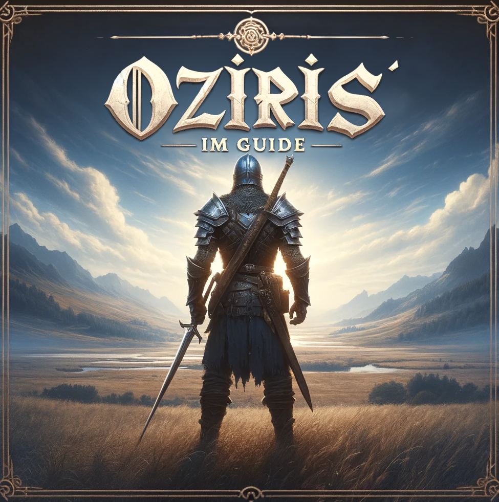

Welcome to the repository for the modernized Old School RuneScape Oziris' Ironman Guide. This project is dedicated to providing a re-worked website to home Oziris' comprehensive, step-by-step guide for Ironman players in the beloved game of Old School RuneScape. Our goal is to offer an easy-to-navigate, informative, and visually appealing website that enhances your gaming experience.

## Features

- **Step-by-Step Ironman Guide**: Detailed instructions and strategies tailored for Ironman mode.
- **Modernized Design**: A sleek, user-friendly interface that improves content accessibility and readability.
- **Interactive Elements**: Interactive tools to plan and track your Ironman journey.
- **Community Contributions**: Opportunities for the OSRS community to contribute tips and tricks.

## Getting Started

To get started with contributing to this project or setting up a local version, follow these steps:

### Prerequisites

- Basic knowledge of HTML, CSS, and JavaScript.
- Familiarity with Git and GitHub.

### Installation

1. Clone the repository:

   ```bash
   git clone https://github.com/yourusername/osrs-oziris-guide-site.git

   ```

2. Navigate to the project directory:

   ```bash
   cd osrs-oziris-guide-site

   ```

3. Install dependencies (if any):

   ```bash
   npm install

   ```

4. Run the project locally:
   ```bash
   npm start
   ```

### Contributing

Contributions are what make the open-source community an incredible place to learn, inspire, and create. Any contributions you make are greatly appreciated.

Fork the Project
Create your Feature Branch (git checkout -b feature/AmazingFeature)
Commit your Changes (git commit -m 'Add some AmazingFeature')
Push to the Branch (git push origin feature/AmazingFeature)
Open a Pull Request

### License

Distributed under the MIT License. See LICENSE for more information.

### Contact

David Smith - @dave_probably

Project Link: https://github.com/Moomins07/osrs-oziris-guide-site

### Acknowledgements

Old School RuneScape
@OzirisLoL for his awesome guide.  
Curtis for his commitment and dedication.

Thank you for visiting our project!
